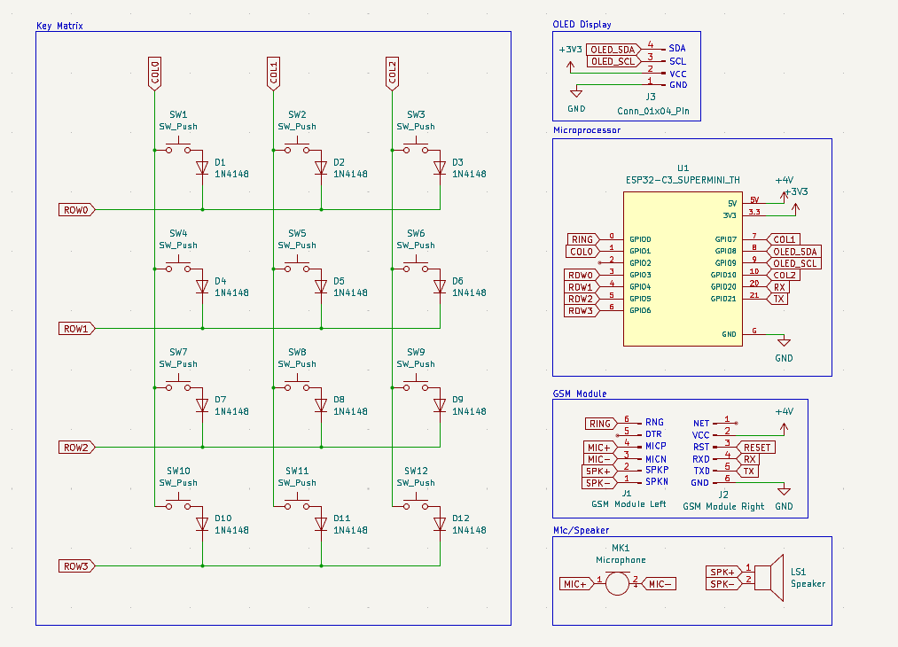
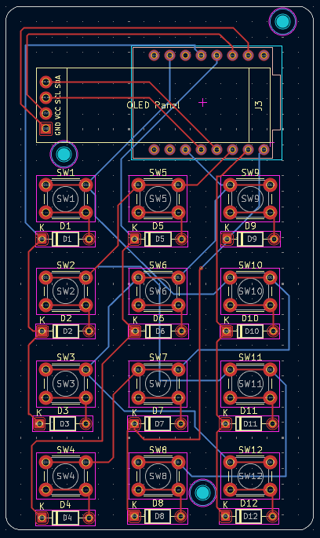
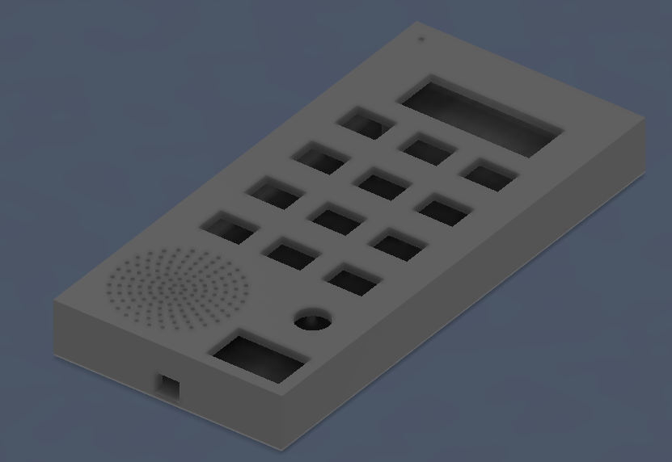
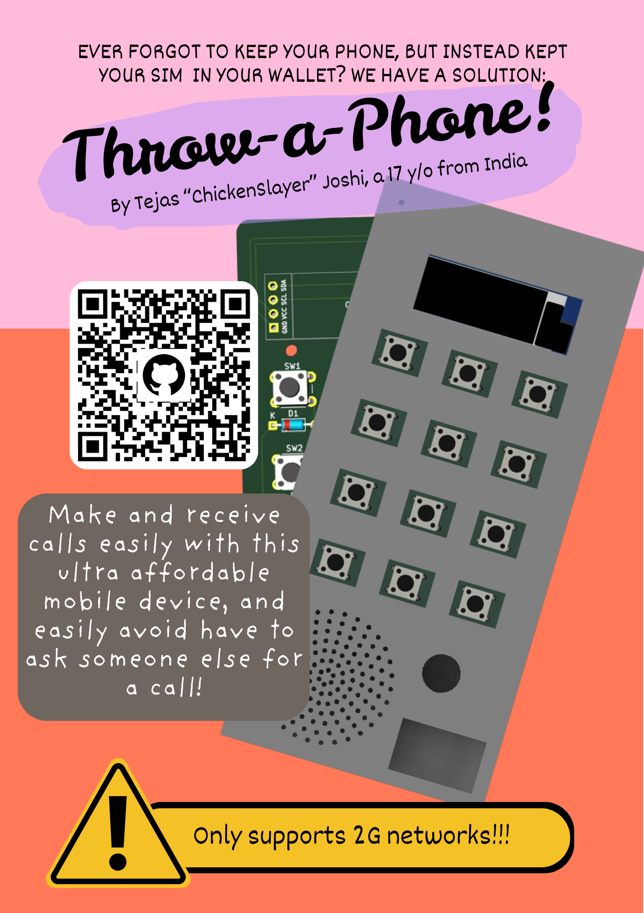

# Throw-a-Phone
Have you ever forgotten your phone at home, and just kept your SIM card along? Me too!
This device aims to solve this common problem faced by us in our daily lives.

In all seriousness, this is a device for people who need absolutely no distractions, or simply a cheap device that can be bought to simply make phone calls without any drama.

## How it works:
Inside the case, there is an ESP32 C3 SUPERMINI, which is compact and affordable - perfect for this use case. Basically, the device uses a 12 key matrix as input, which can be used to enter phone numbers and answer/end calls. The calls are handled using a SIM800L GSM module connected to an external antenna. Due to the hardware used, it can only support 2G networks, which are outdated and may not be available everywhere. 

## PCB:
Here's the Schematic and the PCB:

## Enclosure:
The components are placed within a 3D printed enclosure. The PCB is held in place with round inserts set in place in both the PCB and the Enclosure. 

It has two separate pieces: 
- The top cover, featuring space for the keys, power switch, screen, and audio I/O
- The base, which has obtrusions designed to hold the PCB in place, as well as clearance for an external antenna and charging port.

The two pieces are secured using hot glue.

## Firmware:
The device is coded in C, and makes/receives phone calls by communicating with the GSM module through the UART interface. A key matrix is used to input the numbers and Adafruit libraries are used to control the OLED Display. Different states of the phone have been defined, in which different output is displayed on the OLED.

## Features:
- Making and receiving phone calls

## BOM:
| Product Name                         | Amount |
|--------------------------------------|--------|
| PCB                                  | 1      |
| SIM800L GPRS GSM Module              | 1      |
| 3.7V 1500 mAh LiPo Battery           | 1      |
| Tactile Push Button Switch           | 12     |
| Microphone                           | 1      |
| TP4056 Li-ion battery charging board | 1      |
| 28mm Trumpet Speaker                 | 1      |
| SPST Rocker Switch                   | 1      |
| ESP32-C3 SUPERMINI                   | 1      |
| 0.91 inch I2C OLED Display           | 1      |

## Zine:

